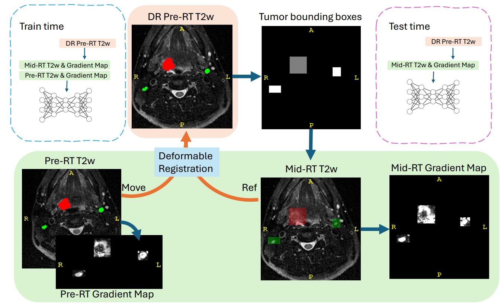

# GradientSegHNTS: 
## Gradient Map-Assisted Head and Neck Tumor Segmentation: A Pre-RT to Mid-RT Approach in MRI-Guided Radiotherapy 
This repository contains the code for Team DCPT Stine's group, developed for the second task of the [HNTS-MRG 2024 challenge](https://hntsmrg24.grand-challenge.org/), focusing on the segmentation of Gross Tumor Volume in the primary (GTVp) and nodal (GTVn) regions for head and neck cancer. 



The shared model weights are public available at : 
[](https://huggingface.co/JintaoRen/GradientSegHNTS)


## Task 2: Mid-RT Segmentation
For Task 2, we tackled the challenge of mid-RT segmentation. Here are our key contributions:

- **Novel Approach Using Pre-RT Data**: We leveraged pre-RT tumor delineations to enhance mid-RT segmentation by identifying Regions of Interest (ROIs) around the tumors using deformably registered pre-RT data.
- **Gradient Maps for Improved Segmentation**: We computed gradient maps from the mid-RT T2w images and used them as additional input channels. Furthermore, we generated similar gradient maps from pre-RT images and their ground truth (GT) delineations to enrich the training data, effectively enhancing segmentation accuracy during the mid-RT phase.

This repository provides a comprehensive solution to the HNTS-MRG 2024 challenge, integrating advanced techniques for accurate head and neck tumor segmentation across different treatment phases.

## nnUNet Customize
Folder ```nnUNet``` presents a customized version of nnUNet with residual encoder UNet, optimized for head and neck tumor segmentation (HNTS).
